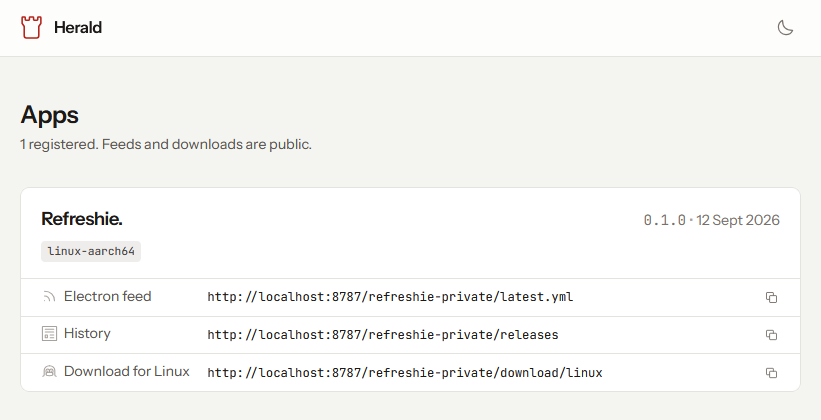
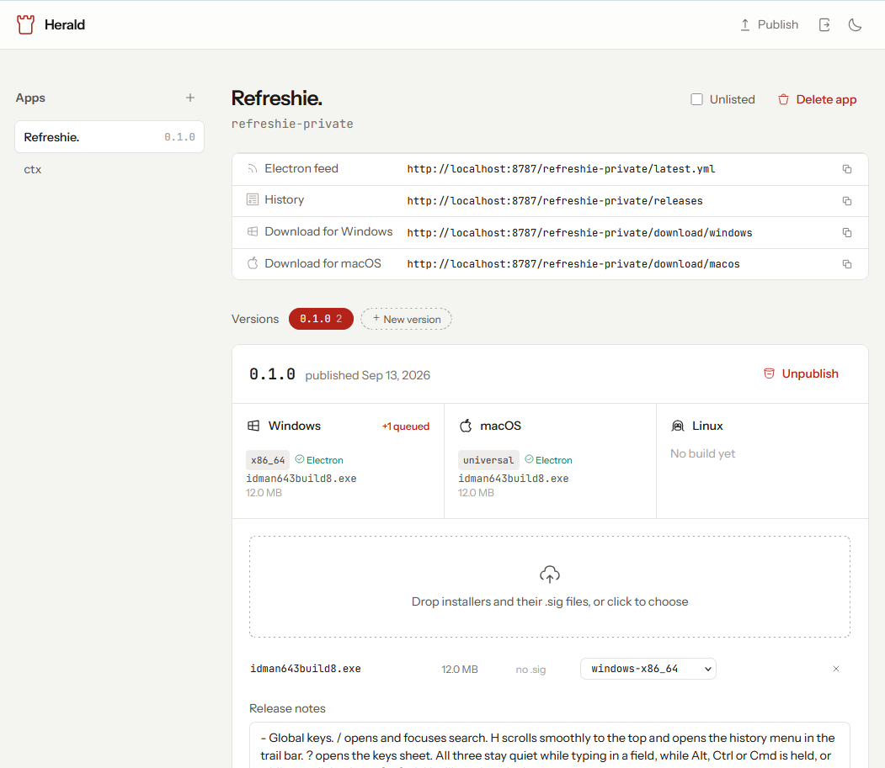

# Herald

Announces new versions to every app you ship. One Cloudflare Worker, one D1
database, one R2 bucket, any number of desktop apps.



Publishing is a picker, not a form: choose the app, choose or add the version,
drop the builds. Each release shows what it has per OS.



Herald stores one neutral release shape and projects it into whatever dialect
each updater speaks, so a Tauri app and an Electron app can live in the same
deployment and be published the same way.

| Framework | Feed it polls | Needs |
|-----------|---------------|-------|
| Tauri | `/:slug/:target/:arch/:version` and `/:slug/latest.json` | a minisign `.sig` |
| Electron (`electron-updater`) | `/:slug/latest.yml`, `latest-mac.yml`, `latest-linux.yml` | a base64 SHA-512 and byte size |
| anything else | `/:slug/download/:platform` | nothing |

An artifact missing what a given updater needs is left out of *that* feed only,
and still downloadable. So an unsigned test build stops auto-updates without
breaking the download button, and adding a hash later turns the Electron feed on
without touching the Tauri one.

Adding a fourth updater (Sparkle's appcast, Squirrel's `RELEASES`) is a function
in `lib/feeds.js` plus a route. The schema does not change.

## Layout

```text
worker.js              routing, and only routing
lib/auth.js            password check, signed session cookie, bearer token
lib/db.js              every D1 query
lib/feeds.js           the dialects, plus version and platform rules. all pure
lib/render.js          {{placeholder}} templating
templates/*.html       real HTML files, imported as text modules
schema.sql
test.mjs
```

Templates are `.html` on disk because wrangler already treats `**/*.html` as a
text module. No build step, no framework, and no HTML trapped inside a
JavaScript string.

Styling is Tailwind's play CDN with Iconoir icons and a light or dark theme
remembered per browser, for the same reason: `wrangler deploy` is the
whole pipeline. That does put a third party script on a page that handles a
password, so if that trade stops being acceptable, compile a stylesheet and
serve it from R2 instead.

## Routes

| Route | What it does |
|-------|--------------|
| `GET /` | App index. `?format=json` for the same data. Unlisted apps are left out |
| `GET /:slug` | One app: its links and every release with notes. Works for unlisted apps too |
| `GET /login`, `POST /login`, `POST /logout` | Sign in with `ADMIN_USER` and `ADMIN_PASSWORD` |
| `GET /admin` | Publishing UI: pick an app, pick or add a version, drop builds. Redirects to `/login` without a session |
| `PUT /:slug` | Create an app, rename it, or toggle it. Body `{"name": "...", "unlisted": true}`, either field optional |
| `DELETE /:slug` | Delete an app and every release |
| `PUT /:slug/upload/:version/:file` | Store an artifact in R2, returns its public URL |
| `GET /files/:slug/:version/:file` | The stored artifact. Public, immutable, range requests |
| `GET /:slug/latest.json` | Tauri feed, all platforms |
| `GET /:slug/:target/:arch/:version` | Tauri templated feed, `204` when the client is current |
| `GET /:slug/latest.yml` | electron-updater, Windows. Also `latest-mac.yml`, `latest-linux.yml` |
| `GET /:slug/releases` | Release history, newest first, up to 100. Enough for a changelog |
| `GET /:slug/releases/:version` | One release with its artifacts and whether each is signed or hashed |
| `GET /:slug/download/:platform` | `302` to the artifact. Takes `windows`, `macos`, `linux`, or an exact key |
| `POST /:slug/releases` | Publish. Artifacts merge per platform; with none, only the notes change |
| `DELETE /:slug/releases/:version` | Unpublish |
| `DELETE /:slug/releases/:version/:platform` | Remove one artifact from a release |

Reads are public: an installed app's updater has no credentials, and neither
does a download button. Writes need either a session cookie or
`Authorization: Bearer $ADMIN_TOKEN`.

`HEAD` is answered like `GET`, so link checkers and download clients that probe
first do not see a 405.

## Authentication

Three secrets, no user table:

| Secret | For |
|--------|-----|
| `ADMIN_USER`, `ADMIN_PASSWORD` | signing in at `/login` |
| `SESSION_SECRET` | signing the session cookie. Any long random string |
| `ADMIN_TOKEN` | non-interactive publishing from CI |

The session cookie carries its own expiry and HMAC signature, so there is no
server side session store and editing the cookie to extend it invalidates it.
It is `HttpOnly`, `SameSite=Lax`, and `Secure` over https. Twelve hours.

A deployment with no `ADMIN_PASSWORD` set is locked, not open, and the login
page says so. Generate the password and the session secret rather than choosing
them:

```sh
openssl rand -base64 32
```

Login and admin traffic is rate limited per client IP with Cloudflare's
[rate limiting binding](https://developers.cloudflare.com/workers/runtime-apis/bindings/rate-limit/),
declared in `wrangler.jsonc` and simulated by `wrangler dev`. Over the limit
answers `429`. Both apply before credentials are checked, so guessing a
password or a bearer token is throttled either way.

| Binding | Routes | Limit |
|---------|--------|-------|
| `LOGIN_LIMIT` | `POST /login` | 5 per minute |
| `ADMIN_LIMIT` | `GET /admin`, upload, publish, unpublish | 60 per minute |

## Behaviour worth knowing

- Latest means the newest `pub_date`, so republishing an older version with a
  fresh date is how you roll back.
- `pub_date` is normalized to UTC before it is stored, because latest is picked
  by a text comparison and a mix of `Z` and `+05:30` would sort wrong.
- A leading `v` is stripped from the version and `0.1` is stored as `0.1.0`.
  Updaters parse the feed version as strict semver and would reject either.
- A release with no artifacts is never served as latest, so a publish that dies
  halfway cannot take a feed down.
- Republishing the same version merges per platform, so the Windows build
  published from one machine and the macOS build from another land in the same
  release. To drop a platform, unpublish the version and publish it again.
- A darwin client is always offered `darwin-universal` as well as its own arch.
- `204` on the Tauri templated route covers both "you are current" and "nothing
  installable for your platform". Neither is something a user can act on. A
  feed that does not exist at all is a `404`.
- The index links only to feeds an app actually has, so it never advertises a
  URL that 404s.
- R2 keys are `slug/version/filename`, so an object at a given key never
  changes and `/files/` is served `immutable` with a one year max-age.
- Deleting a release removes its rows, not its R2 objects. That is deliberate:
  installed clients hold signed URLs pointing at them. Prune the bucket by hand
  when you are sure nothing is still on them.
- `files`, `admin`, `login` and `logout` are reserved and cannot be app slugs.
- An unlisted app is off the home page and its JSON, nothing more. Its page,
  feeds and downloads answer to anyone with the slug. A deterrent for a
  private build, not access control.

## Environments

Three targets, each with its own database and bucket, so a staging release can
be published and installed end to end without touching what real apps poll.

| Target | Worker | Database and bucket | Host |
|--------|--------|---------------------|------|
| top level | `herald` | `herald-dev`, simulated locally | `wrangler dev` only |
| `--env staging` | `herald-staging` | `herald-staging` | `workers.dev` |
| `--env production` | `herald` | `herald` | `herald.thinkdj.xyz` |

Bindings are **not** inherited by environments, so each one declares its own.
That is also why every real deploy names an environment: a bare
`wrangler deploy` would publish with the development bindings attached.

```sh
pnpm run dev:herald              # local, simulated D1 and R2
pnpm run deploy:herald:staging
pnpm run deploy:herald           # production
```

## Setup

Once per environment. Replace `staging` with `production` for the real one.

```sh
pnpm wrangler d1 create herald-staging
# paste the returned database_id into that environment's block in wrangler.jsonc
pnpm wrangler r2 bucket create herald-staging
pnpm wrangler d1 execute herald-staging --remote \
  --config herald/wrangler.jsonc --file herald/schema.sql

for s in ADMIN_USER ADMIN_PASSWORD SESSION_SECRET ADMIN_TOKEN; do
  pnpm wrangler secret put $s --config herald/wrangler.jsonc --env staging
done

pnpm run deploy:herald:staging
```

Give staging and production different credentials. A password pasted into a
staging admin page should not publish to production.

Keep both buckets private. Nothing needs public bucket access: the worker is
the only reader, and it serves files itself under `/files/`.

Local development needs no secrets on disk:

```sh
pnpm wrangler d1 execute herald-dev --local \
  --config herald/wrangler.jsonc --file herald/schema.sql
pnpm wrangler dev --config herald/wrangler.jsonc --local \
  --var ADMIN_USER:ops --var ADMIN_PASSWORD:dev --var SESSION_SECRET:devsign
```

## Publishing: the admin page

Sign in at `/login`, then drop a build output folder on `/admin`. The page:

1. Pairs each installer with its `.sig` file by name.
2. Guesses each platform key from the filename, shown in a dropdown you can
   correct. A macOS universal bundle and a single arch one can be named the
   same, so the guess is a starting point.
3. Computes each file's SHA-512 in the browser, which is why Electron feeds
   work without the worker ever buffering an upload to hash it.
4. Uploads the installers, reads the signatures as text, and publishes.

The `.sig` files are never uploaded: their contents belong in the feed, not the
bucket.

Uploads go through the worker, so they are subject to the Workers request body
limit, 100 MB on the free plan. Desktop installers are a few megabytes.

## Publishing: from CI or by hand

Same thing with curl, and the only option when the artifacts are hosted
elsewhere (a public repo's release assets, any static host):

```sh
curl -X POST https://herald.thinkdj.xyz/ctx/releases \
  -H "Authorization: Bearer $ADMIN_TOKEN" \
  -H "content-type: application/json" \
  -d '{
    "name": "ctx",
    "version": "0.1.1",
    "notes": "Typed prompt variables and sections.",
    "artifacts": {
      "windows-x86_64": {
        "url": "https://github.com/you/ctx/releases/download/v0.1.1/ctx_0.1.1_x64_en-US.msi",
        "signature": "PASTE THE .sig CONTENTS",
        "sha512": "BASE64 SHA-512, optional, enables the electron feed",
        "size": 3862528
      },
      "darwin-universal": {
        "url": "https://github.com/you/ctx/releases/download/v0.1.1/ctx_universal.app.tar.gz",
        "signature": "PASTE THE .sig CONTENTS"
      }
    }
  }'
```

Adding a second app is the same call with a different slug. Nothing to deploy.

To upload the bytes to Herald instead, `PUT` each file first and use the `url`
it returns:

```sh
curl -X PUT "https://herald.thinkdj.xyz/ctx/upload/0.1.1/ctx_0.1.1_x64_en-US.msi" \
  -H "Authorization: Bearer $ADMIN_TOKEN" \
  -H "x-herald-sha512: $(openssl dgst -sha512 -binary ctx.msi | base64)" \
  --data-binary @ctx_0.1.1_x64_en-US.msi
```

## Pointing an app at it

Tauri, in `src-tauri/tauri.conf.json`:

```json
"bundle": { "createUpdaterArtifacts": true },
"plugins": {
  "updater": {
    "endpoints": ["https://herald.thinkdj.xyz/ctx/{{target}}/{{arch}}/{{current_version}}"],
    "pubkey": "PASTE THE PUBLIC KEY"
  }
}
```

`createUpdaterArtifacts` is required: without it the bundler emits no `.sig`
files at all. The pubkey comes from `pnpm tauri signer generate`; keep the
private key and its password in CI secrets as `TAURI_SIGNING_PRIVATE_KEY` and
`TAURI_SIGNING_PRIVATE_KEY_PASSWORD`.

Electron, in `package.json` or `electron-builder.yml`:

```yaml
publish:
  provider: generic
  url: https://herald.thinkdj.xyz/myapp
```

## Site download buttons

Link straight at Herald and never touch the markup again on a release:

```html
<a href="https://herald.thinkdj.xyz/ctx/download/windows">Download for Windows</a>
<a href="https://herald.thinkdj.xyz/ctx/download/macos">Download for macOS</a>
```

## Tests

```sh
pnpm run test:herald
```

Covers version comparison and normalization, platform guessing and resolution,
both feed dialects and the YAML emitter, template escaping, that every
placeholder a template uses is one a route supplies, that the admin page's
inline script parses, and the auth surface: constant time compare, a locked
deployment with no secrets, and session cookies against forgery, a swapped
signing secret, an extended expiry, and expiry itself.

The D1, R2, and routing layers are verified by hand against the simulated local
resources, and both deploy targets can be checked without publishing:

```sh
pnpm wrangler deploy --config herald/wrangler.jsonc --env staging --dry-run
pnpm wrangler deploy --config herald/wrangler.jsonc --env production --dry-run
```

It prints which database and bucket each environment resolved to, which is the
cheapest way to catch a binding pointed at the wrong one.
